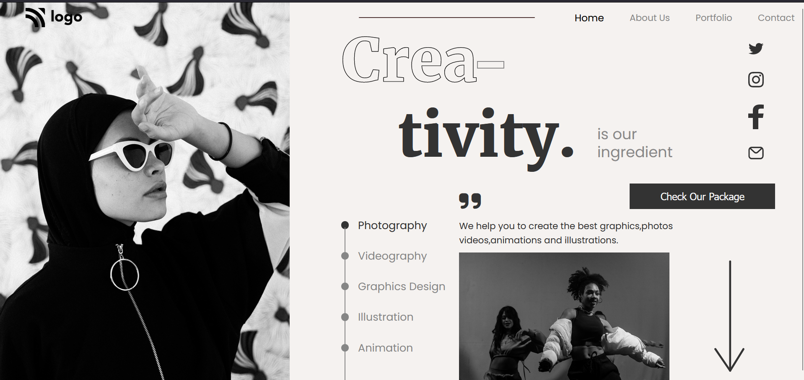

# Dance Home Landing Page
   
  
  

## Concepts learnt through this project
- Selectors
- Psuedo Selectors
- Absolute Positioning
- Relative Positioning
- styling buttons
- giving stroke to text
- designing dots
# Output:
  

### Time taken: 6 hours
### Live Link - 